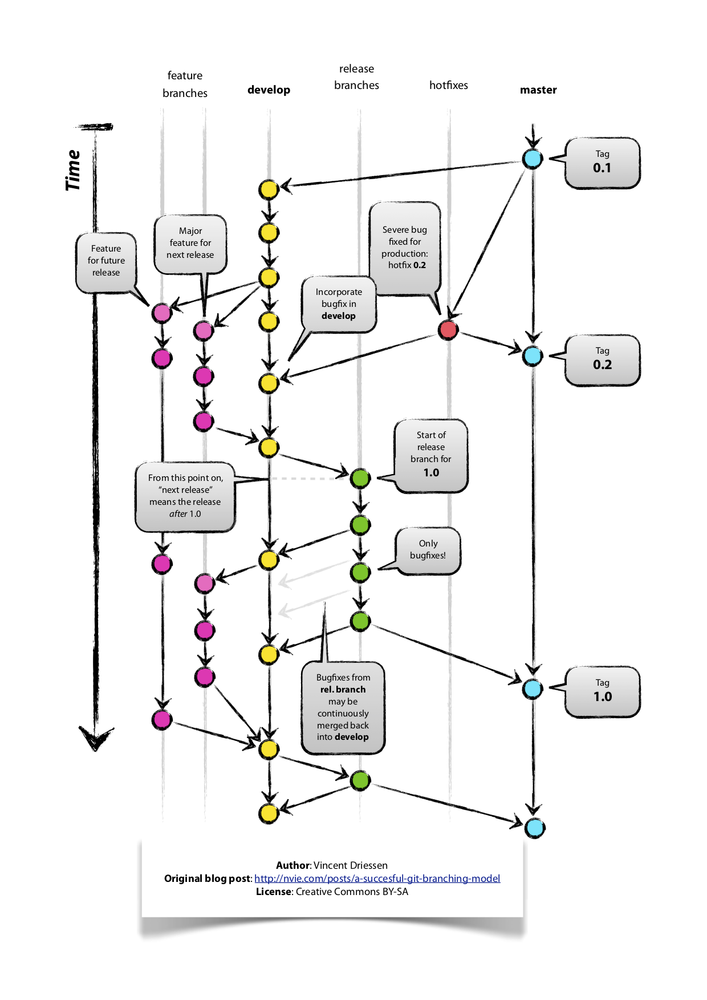

# Coding bible

*This project follows PSR-4 coding standards and those recommended by Sylius and Symfony projects in this order. It is extended based on experience of the whole BitBag team for everybody's sake.*

- [Code Style](#code-style)
- [General](#general)
- [Symfony / Sylius / Frameworks](#symfony--sylius--frameworks)
- [Testing](#testing)
- [OOP / Architecture](#oop--architecture)
- [Workflow](#workflow)
- [Open Source](#open-source)
- [Git](#git)


## Code Style

0. Always follow PSR-4 recommendations;
1. `$elements = [1, 2, 3];` instead of `$elements = array(1, 2, 3);`
2. Don't use annotations. Don't mess up the definition with implementation;
3. Use Yoda-Style comparisons `null === $var->getResult($anotherVar)` instead of `$var->getResult($anotherVar) === null`
4. Don't use PHPDoc. Use it only when it is REALLY valuable and in interfaces that return array of objects or collections, like:

```php
interface Foo
{
    /**
     * @return Collection|ItemInterface[]
     */
    public function getItems(): Collection;
}
```

5. Use inline PHPDoc only for fields inside the class, like:

```php
final class Foo
{
    /** @var int */
    private $foo;
    
    /** @var string */
    private $bar;
    
    public function getFoo(): ?int
    {
        return $this->foo;
    }
    
    public function getBar(): ?string
    {
        return $this->bar;
    }
}
```

6. Keep a blank line above the `@return` method definition in case it has more than `@return` annotation, for instance

```php
interface Foo
{
    /**
     * @param string $key some valid and important comment
     *
     * @return Collection|ItemInterface[]
     */
    public function getItemsWithoutKey(string $key): Collection;
}
```

7. Always use strict types declaration in each class header, like:

```php
<?php

declare(strict_types=1);

namespace Foo\Bar;

final class Foo
{
}
```

8. A method must not have more than two parameters inline. Otherwise split them with `\n`. In an edgecase where two parameters are too long to fit your (and potentially your colleagues) screen, split them as well. Examples:

```php
public function foo(string $firstParam, string $secondParam): void;

public function bar(
    FirstParamInterface $firstParam, 
    SecondParamInterface $secondParam,
    ThirdParamInterface $thirdParam
): void;

public function fooBarIsALongMethodName(
    WithEvenALongerParameter $firstParam,
    AndASecondParameterThatIsNotShorter $secondParameter
): void;
```

9. Always use a trailing comma in arrays

```php
$flavors = [
   'chocolate',
   'vanilla',
];
```

10. Good to follow practices from https://mnapoli.fr/approaching-coding-style-rationally/
11. Once you use PHPStorm (and yes, you do if you work at BitBag), 
you can open your IDE preferences (`PHPStorm -> Preferences`) and search for `File and Code Templates`. 
PHP Class Doc Comment, PHP File Header, PHP Interface Doc Comment 
are those templates that should at least be customized.
12. Always use Easy Coding Standard library for code cleanup. We use one from the official [Sylius Labs repository](https://github.com/SyliusLabs/CodingStandard). If you start the project from scratch, use PHPStan. We use the [official Sylius setup](https://github.com/Sylius/Sylius/blob/master/phpstan.neon.dist).
Both ECS and PHPStan should be included in the CI process.

## General

0. No `/.idea` and other local config files in `.gitignore`. Put them into global gitignore file, read more on https://help.github.com/articles/ignoring-files/#create-a-global-gitignore.
1. We are working on NIX systems and we don't like Windows nor are we solving it's existance goal and other problems.
2. Code that is not documented doesn't exist. Writing a documentation of a bundle/plugin/project is part of the development process. Remember that in the end someone else is going to use your code who might not know each part of it. This also applies to writing Github repository description, basic composer package information, etc. 


## Symfony / Sylius / Frameworks

0. Use YAML (`*.yaml`) for defining routings and configs;
1. Use XML (`*.xml`) for defining services, doctrine, and validation definitions;
2. For services definitions in a single bundle use `form.xml`, `event_listener.xml`, etc. Don't put everything in the `services.xml` file, do it in public projects with only a few services. If you have more than one type of service inside your app, create a separate config file under `services/` directory.
3. Repositories and Entities in public projects should not (and cannot) be defined as `final`. 
4. Entity fields in public projects (vendors) should be `protected` instad of `private`.
5. Decorate resource factories with decoration pattern and do not call resource instance with `new` keyword directly. Instead, inject resource factory into constructor and call `createNew()` on it. See `Sylius\Component\Product\Factory\ProductFactory`, `sylius.custom_factory.product` service definition and [Symfony Service Decoration](https://symfony.com/doc/current/service_container/service_decoration.html). The `priority` flag we are starting with equals 1 and is increased by one for each other decoration.
6. For customizing forms use [Symfony Form Extension](https://symfony.com/doc/current/form/create_form_type_extension.html).
7. We follow command pattern implemented in [SyliusShopApiPlugin](https://github.com/Sylius/SyliusShopApiPlugin). This means we use the same bus libraries and similar `Command, CommandHandler, ViewRepository, ViewFactory, View` approach.
8. Creating a CLI Command using Symfony Console Component should follow the following rules:
    - `execute` method should have `int` as a return type. For the **successful** run, the command should return `0`. For any errors during execution the return can be `1` or any different *error code number*.
9. In Sylius plugins, use traits for customizing models and use them inside your `tests/Application/src` for testing. This way we avoid handling reference conflicts in the final app.
10. We don't use either autowire nor autoconfigure Symfony options as it is a very "magic" way of defining services. We always prefer to manually define services and inject proper arguments into them to have better control of our Container.
11. If some of the service definition is tagged, don't use FQCN (Fully Qualified Class Name) as the service id.
12. Don't use Sylius theme if you have one template in your project.

## Testing

0. Before you implement any new functional feature, write Behat scenario first (Gherkin, `*.feature` file).
1. After writing the scenario, write a proper scenario execution (Contexts, Pages).
2. Use Behat Contexts that are divided into `Hooks` - generic app Background, `Setup` specific resource background, `Ui` - specific interaction.
3. Before starting implementing new functional code, make sure all your core logic is covered with PHPSpec (code without framework dependencies, like Commands, Forms, Configuration, Fixtures, etc.)
4. PHPSpecs are always final classes with `function`s without `public` visibility and `: void` return type:

```php
final class ProductSpec extends ObjectBehavior
{
    function it_follows_bitbag_coding_standards(): void
    {
        Assert::true($this->followsStandards());
    }
}
```


## OOP / Architecture

0. Make your code as simple as it's possible (follow single responsibilty principle and KISS principle).
1. Use interfaces for any core logic class implementation, especially Models and Services (so that you follow single responsibilty principle).
2. Use `final` any time it is possible (in order to avoid infinite inheritance chain, in order to customize some parts use Decorator and Dependency Injection patterns).
	- The only exception to this rule is only for a framework/library specific requirements. I.e Doctrine Entities cannot be a final classes because of reflection issues.
4. Be more careful when you think Singleton is something you need in project. If it is you should go and rething the code.
5. Be careful with `static` statement, probably you will never need to use it.
6. Use ADR pattern for controllers. For instance, your controller should not extend any class and contain just an `__invoke` method. It should also be suffixed with `Action` keyword.

```php
<?php

declare(strict_types=1);

namespace App\Controller\Action;

use Symfony\Component\HttpFoundation\Request;
use Symfony\Component\HttpFoundation\Response;
use App\Repository\FooRepositoryInterface;

final class SayHelloToTheWorldAction
{
    /** @var FooRepositoryInterface */
    private $fooRepository;

    public function __construct(FooRepositoryInterface $fooRepository)
    {
        $this->fooRepository = $fooRepository;
    }

    public function __invoke(Request $request): Response
    {
        return new Response("Hello world!");
    }
}
```


## Workflow

0. Commit messages should be written (if only it's possible) with the following convention:
`[Project spec state][Bundle] max 64 characters description in english written in Present Simple.`
1. If there is an opened issue on Jira for a specific task, your branch should be named `sit_[ISSUE_NUMBER]`. If not, it should be named with the first letter of your name and your surname. In my case (Mikołaj Król) it would be `mkrol`.


## Open Source

0. Open source is made by forks if only more than one person is in charge of maintenance of specific package.
1. We follow http://docs.sylius.org/en/latest/contributing/ contribution standards
2. Any `*.php` file created by the BitBag developer (in Open Source project) needs to have at least the following definition where the author is the user who created this file:

```php
<?php

/*
 * This file has been created by developers from BitBag.
 * Feel free to contact us once you face any issues or want to start
 * another great project.
 * You can find more information about us on https://bitbag.shop and write us
 * an email on mikolaj.krol@bitbag.pl.
 */

 declare(strict_types=1);
 
 namespace Foo;
 
 use Foo\Bar\App;
 
 final class Bar implements BarInterface
 {
     public const SOME_CONST = 'foo';
     public const SOME_OTHER_CONST = 'bar';
     
     /** @var string */
     private $someProperty;
    
     public function inheritedMethod(): string
     {
         //some body
     }
     
     private function someFunction(SomeServiceInterface $someService): ?NullOrInterfacedObject
     {
         $items = $someService->getCollection();
         
         /** @var WeUseThisBlockDefinitionIfNecessaryOfCourseWithInterface $someOtherProperty */
         $someOtherProperty = $someService->getSomething();
         // Use break line between any operation in your code. Imagine the code as block diagram, where every new line is an arrow between operations.
         foreach ($items as $item) {
             $item->doSomething();
             
             if (false === $item->getProperty()) { // Always use strict comparison with expected result on the left
                 return;
             }
             
             continue;
         }
         
         $someService->someOutputAction();
         
         $this->someProperty->someOtherOutputAction();
         
         return $someOtherProperty;
     }
 }
```

## Git

-1. Not confident with Git yet? Visit [the simple guide](http://rogerdudler.github.io/git-guide/)!
0. Use [Gitflow](https://nvie.com/posts/a-successful-git-branching-model/) whenever you can:

1. How to write a commit message and use Git in a proper way? Read [here](https://github.com/RomuloOliveira/commit-messages-guide)
2. If you use Git in IDE - make sure it follows all standards. We don't care what GUI/CLI you use as long as you know what happens under the hood.


**Be smart and keep in mind that once you do something stupid, I will find you and I will force you to work with Laravel or Magento.**
**There is nothing called stupid question, but please ask it in a smart way :).**
**It's better to talk about a feature with the whole team for 30 minutes than lose 8 hours on implementing some dummy code that will destroy the current codebase order and deep the technical debt.**
